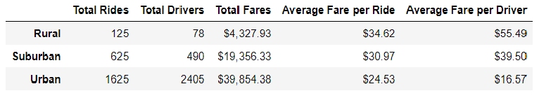
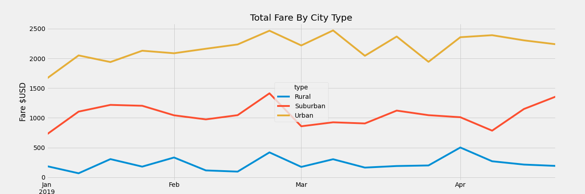

# PyBer Analysis - Fares by City Type.

## Overview 

In this analysis we will look at PyBer's fares collected across different types of city: Urban, Suburban and Rural. We will create a summary data frame of the ride-sharing data by city type, that will include for each city type: total rides, total drivers, total fares, average fare per ride, and average fare per driver. Then we will look at the data over a given time period and create a multiple-line graph that shows the total fares for each city type plotted using weekly figures. We will then be able to see how the data differs by city type and how those differences can be used by decision-makers at PyBer.

## Resources
Jupyter notebook

[city_data.csv](Resources/city_data.csv)

[ride_data.csv](Resources/ride_data.csv)

## Results

[Code for this analysis](PyBer_Challenge.ipynb)

Combining the city_data and ride_data we are able the following by summary for each city type.  We can see the experince for drivers is quite different for each city type.

### Total rides
 * Urban cities have by far the most rides at 1625.
  * Suburban cities have 625.
  * Rural cities have 125. 

  ### Total Drivers
  * As expected Urban has the highest number of drivers, 2405.
  * Suburban cities have 490.
  * Rural cities just 78.

  ### Total Fares

* Urban cities have highest revenue with $39,854.38
* Suburban cities have about 50% at $19,356.33
* Rural cities make $4327.93

### Average fare per ride

* Rural rides are the most lucrative at $34.62. Perhaps, due to the greater distances between locales.  
* Suburban rides average $30.97
* Urban rides are the cheapest averaging $24.53.

### Average fare per driver
* Rural drivers bring the highest fare per driver. $55.49
* Suburban drivers average $39.50
* Urban just $16.57

### Total fares by city type. (January 2019 through April 2019)

* We can see that Urban cities accrue the highest total fares. Up $2500 a week, rarely below $2000

* Suburban cities have second highest totals. ~ $800 to $1400 a week.

* Rural cities are a lot lower: the highest total is ~$500 but they are usually around half that.

* The third week of February was a great week for all city types.
## City Types
* Urban cities - High Totals due to very large number of drivers bringing in smaller fares.

* Suburban cities have 50% of the total fares of Urban with just ~20% of the drivers, and ~30% of the rides compared to Urban. Each driver brings in higher fares, and the average ride is longer.

* Rural cities have lowest total fares earned, ~8% of Urban cities.  They have much fewer drivers, that earn much higher fares. The rural rides are longer.

## Summary

* Although rural cities provide least revenue. The individual drivers earn the most.  Adding more high earning rural drivers could help increase rural revenue.  We could also aim to increase short journeys in rural areas.

* Urban cities have the highest total drivers and fares, but the lowest averages for per driver and per trip fares.  This is likely due to urban folk taking shorter rides.  If we looked to ways of encouraging riders to travel further, perhaps partnering/advertising with destinations on the peripheries of town such as airports, theme parks we could increase driver averages.  

* Although we have seen Pyber experience is a different experiece in all city types. We can see they follow a similar course throughout the year. They all had a peak on the third week of February, it is worth exploring further to see if we can find the cause.  

